# S3
**S3 is a globally available service but when you create a bucket you specify a region**

## S3 Bucket Naming Rules
- S3 bucket names are used to form URL links to perform various HTTPs operations.
- 3 - 63 characters long
- only lowercase, numbers, dot, hypens
- begin and end end with a letter or number
- cannot be formated as IP addresses (192.168.0.2)
- no double hypens(--)
- Must be unique across all AWS accounts in all AWS regions within a partition
- A name can't be reused in the partition util the original bucket is deleted
- No Uppercase, No Underscores, No spaces in bucket names

## S3 Bucket Restrictions and Limitations
- You can by default create 100 buckets (for more you need increase through service request)
- Empty a bucket first before you delete it
- No max bucket size and no limit to the number of objects in a bucket
- File size should be between 0B to 5TB
- Files larger than 100MB should be mult-part upload
- S3 for AWS outposts has limits
- Get, Put, List and delete operations are designed for high availability
- Create, delete or configuration operations should be run less often

## S3 Bucket Types
- S3 has two types of buckets.
### General Purpose buckets
- organizes data in a ==flat hierarchy==
- the original s3 bucket type
- recommended for most use cases
- used with all storage classes except can't be used with S3 Express One Zone storage class
- there aren't prefix limits
- there is a default limit of 100 general buckets perf account
### Directory Bucket
- organizes data ==folder hierarchy==
- only to be used with **S3 Express One Zone storage class**
- recommended when you need single-digit millisecond performance on PUT and GET
- there aren't prefix limits for directory buckets
- Individual directories can scale horizantly
- There is a default limit of 10 directory buckets per account

## S3 Bucket Folders
- S3 console allows you to create folders. They don't have true folders
- when you create a folder in s3 console, Amazon S3 creates a ==zero-byte== s3 object with a name that ends in a forward slash eg: myfolder/
- s3 folders are not their own independent identities but just s3 objects
- s3 folders don't include metadata, permissions
- s3 folders don't contain anything, they can't be full or empty
- s3 folders aren't moved, s3 objects containing the same prefix are renamed
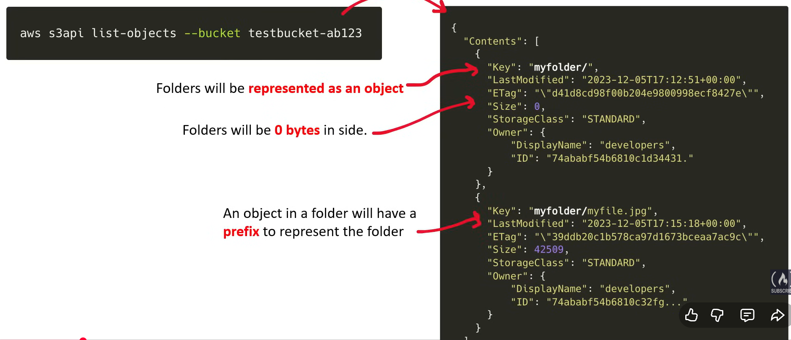

## S3 Object Overview
- S3 objects are resources that represent data and is not infrastructure

### 1. Etags - a way to detect when the contents of an object has changed without downloading the contents.
- An entity tag is response header that represent a resource that has changed
- generally represented by a hashing function
- Etgas are part of the HTTP protocol
- ETags are used for revalidation for caching systems
- reflects only contents, not metadata
- represents a specific version of an object
- **Etags are useful if you want to programmatically detect content changes to S3 objects**

### 2. Checksums - ensures the integrity of a files beging uploaded or dwonloaded
- A checksum is used to check the sum(amount) of data to ensure the data integrity of a file.
- If data is downloaded and if in-transit data is loss or mangled the checksum will determine this is something wrong with the file
- Amazon S3 uses checksums to verify data integrity of files on the upload or download
- AWS allows you to change the checksum algorithm during uploading an object

### 3. Object prefixes - simulates file system folders in a flat hierarchy
- Strings that proceed the object filename and is part of the object key name.
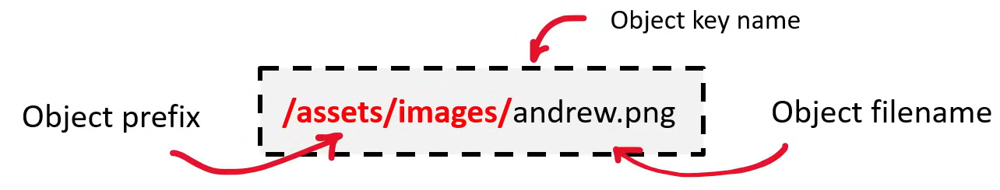
- Object prefixes allows for a way to arganize, group and filter objects
- prefixes are not true folders, "/" as a demilitator to group similar data.
- the only limit is the object key name should not exceed 1024 bytes

### 4. Object metadata - attach data alongside the content, to describe the contents of the data
- S3 Allows you to attach metadata to s3 objects at anytime.
- resource tags, object tags are similar to metadata but tags are intended to provide information about cloud resources and not the contents of the object.
#### S3 Object system defined metadata
- Data that only amazon can control
- Most of these cannot be set, but some can.
- Cannot be modified: Cache Control, Content disposition, Content encoding, Content language
- can be: content type
#### S3 - user defined metadata
- user defined metadata is set by user and must start with ==x-amz-meta-==, you don't need to add this. You can just provide key value pairs, and aws adds them automatically.
- eg: access and security, media file, custom application, project specific, document versioning, content-related, compliance and legal

### 5. Object tags - benefits resource tagging but at the object level

### WORM
- Write once read many is a storage compliance feature that makes data immutable, you write once and the file never be modified, but you can read unlimited times.
- WORM is useful in healthcare or financial industries where files need to be audited and untampered.

### 6. Object locking - makes data files immutable 
- allows to prevent the deletion of objects in a bucket
- this feature can only be turned on at the creation of a bucket
- you can use it prevent an object from begin deleted or overwritten for:
    - a fixed amount of time
    - or indefinitely
- S3 buckets with object lock can't be used as destination buckets for server access logs
- Object retention is handled in two ways
1. Retention periods - fixed period of time during which an object remains locked.
2. Legal holds - remains locked until you remove the hold.
```Bash
aws s3api put-object \
--bucket your-bucket-name \
--key your-object-key \
--body file-to-upload \
--object-lock-mode GOVERNANCE \
--object-lock-retain-until-date "2025-01-01T00:00:00Z"
```
- ==Object locking can only be done through AWS Api, cannot be done through console==

### 7. Object versioning - have multiple versions of a data file

### Amazon S3 bucket URI
- The s3 bucket URI (uniform resource identifier) is a way to reference the address of s3 bucket and objects
### AWS S3 CLI
- **aws s3** -- high level way to interact with s3 buckets and objects
- **aws s3api** -- a low level way to interact with s3 buckets and objects
- **aws s3control** -- managing s3 access points, s3 outpost buckets, s3 batch operations, storage lens
- **aws s3outposts** -- manage endpoints for s3 outposts

### Request styles

#### 1. Virtaul hosted-style request
- the bucket name is a subdomain on the post
#### 2. Path-style request
- the bucket name is in the request path 
- these will be discontinued in the future

## Dualstack endpoints
- Dualstack endpoints - there are *two possible endpoints when accessing Amazon s3 api
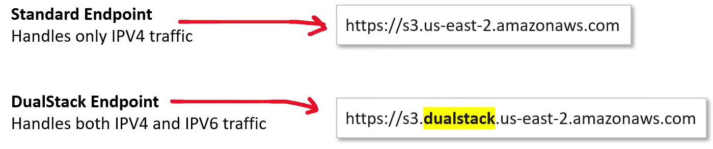
- **Standard endpoint** - handles only ipv4 traffic
- **Dualstack endpoint** - handles both IPv4 and IPv6 traffic
- Dualstack is designed as its future replacement since IPv4 addresses are running out and IPv6 has a larget public address space.
- AWS CLI likely uses dualstack underneath.

## S3 Storage Classes Overview
- AWS offers range of s3 storage classes that trade Retrieval, Time, Accessibility and Durability for **Cheaper storage**
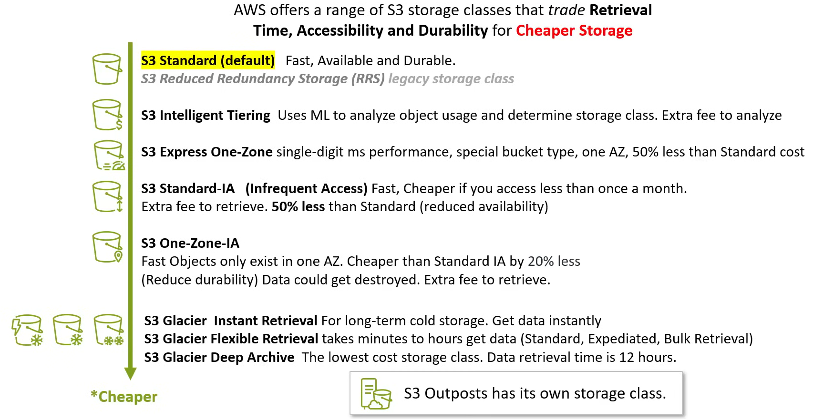

### Standard -- Storage Class
- default storage class
- General purpose storage for frequently accessed data
- High durability -- **11 9's**
- High Availability -- **4 9's**
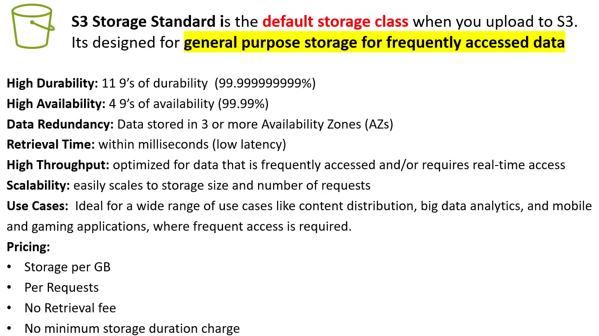

### RRS -- Reduced Redundancy Storage
- Is a legacy storage class to store **non-critical** reproducible data at lower levels of redundancy that Amazon S3's standart storage.
- Now S3 standard is cheaper than RRS. (So not recommended to use standard)

### Standard IA
- IA(Infrequent access) storage class is designed for data that is less frequently accessed but requires rapid access when needed.
- Costs - 50% less than standard. As long as you don't access a file more than once a month.
- Has a retrieval fee
- Has a minimum storage duration charge of 30 days.
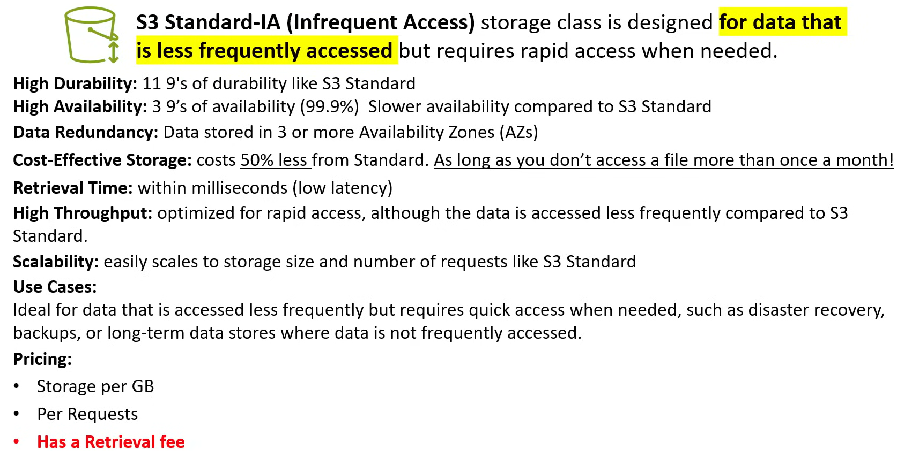

### Express One Zone IA
- delivers consistent singl-digit millisecond data access for your most frequently accessed data and latency-sensitive applications
- the lowest latency
- 10x faster than standart
- stored in a user selected single AZ
- data is stored in a new bucket type **an Amazone S3 Directory bucket**
- S3 directory bucket supports simple real-folder structure, you are only allowed 20 by default S3 directory bucket per account
- Express one zone applies a flat per request charge for request sizes upto 512 KB
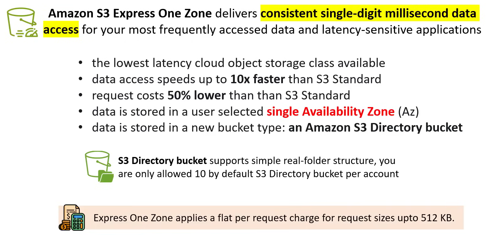

### One Zone IA
- One Zone Infrequent Access storage class is designed for data that is less frequently access and has additional saving at reduced availability.
- costs 20% less from standard IA
- there is risk of data loss in-case of AZ disaster
- ideal for secondary data copies, that can be recreated
- non mission critical
- Has a minimum storage duration charge of 30 days
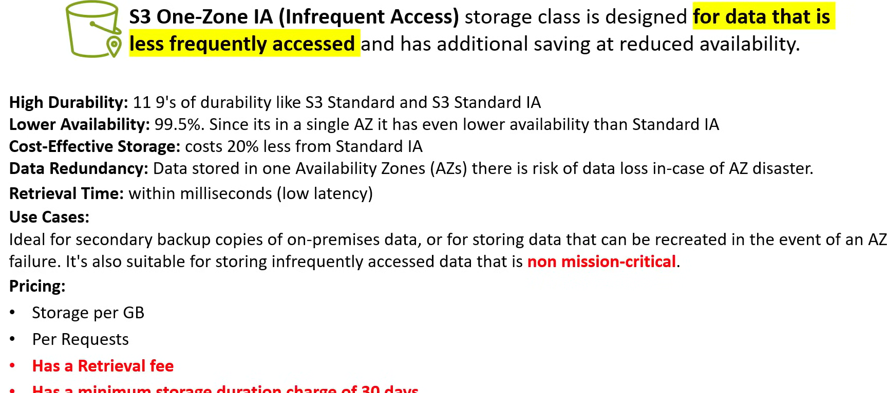

### S3 Glacier Storage Classes vs S3 Glacier "Vault"
#### S3 Glacier vault
- S3 Glacier is a stand alone service from s3 **that uses valuts** over bucekt to store data long term
- S3 Glacier is the original vautl service
- It has vault control policies
- Most interactions occur via the AWS CLI
- Enterprises are still using S3 Glacier Vault
- **S3 Glacier Deep** archive is part of S3 Glacier "vault".
#### S3 Glacier Storage Classes
- S3 Glacier Storage Classes offer similar functionally to S3 Glacier but with greater convenience and flexibility all within S3 buckets.
- This is new calss with no attachment to S3 Glacier Vault
- These two are using S3 Glacier Vault underneath
    - S3 Glacier Flexible
    - S3 Glacier Deep Archive
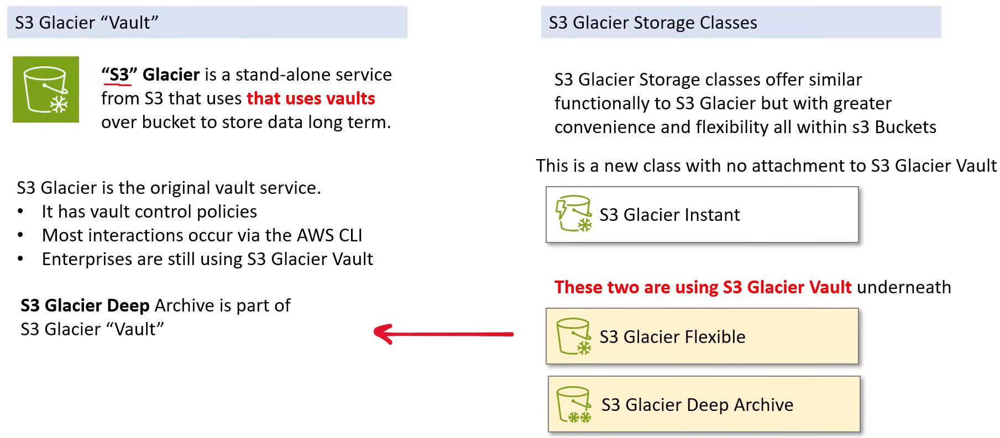


### S3 Storage Classes Glacier Instant Retrieval
- Designed to **rarely accessed data** that still needs **immediate access** in performance-sensitive use cases.
- 68% lower than Standard IA
- For long lived data that is **accessed once per quarter**
- Minimum storage duration of 90 days.
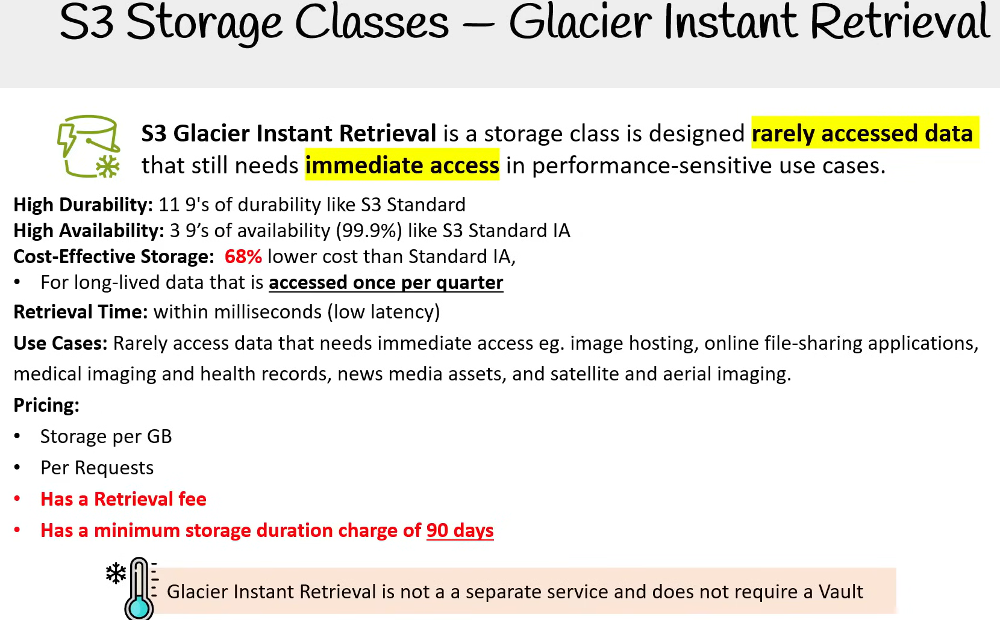

### S3 Glacier Flexible Retrival
- combines S3 and Glacier into a single set of APIs. It's considerably **faster than Glacier Vault-based storage**.
- 3 retrival tiers
    - Expediated Tier (1-5 mins) -- Limited to 250MB archive size
    - Standart Tier (3-5 hours) -- No archive size limit. This is default option
    - Bulk Tier (5-12 hours) -- No archive size limit, even petabytes worth of data.
- You pay per GB retrieved.
- Seperate cost to store the data.
- 40KBs of additional data.
    - 32KB of archive index and archive metadata information
    - 8KB for the name the object.
- **You should store fewer and larger files**, instead of smaller files. 40KBs on thousands of files add up.


### S3 Glacier Deep Archive
- combines S3 and Glacier into a single set of APIs. It is more cost-effective than S3 Glacier Flexible but greater cost of retrival.
- Two retrieval tiers
    - Standard (12-48 hrs) -- No archive size limit. This is default option
    - Bulk Tier (12-48) -- No archive size limit, even petabytes of data.
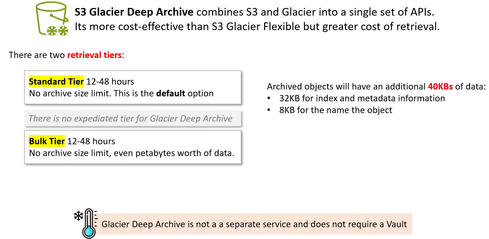

### S3 Intelligent Tiering
- automatically moves objects into different storage tiers to reduce storage costs, but charges a low month cost for object monitoring and automation.
- Have access tiers, and moves the objects accordingly.
- S3 Intellingent Tiering has additional cost to analyze your objects for 30 days
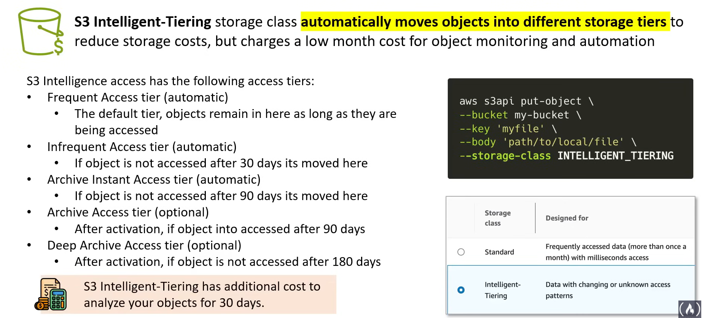

### Storage Classes Comparison
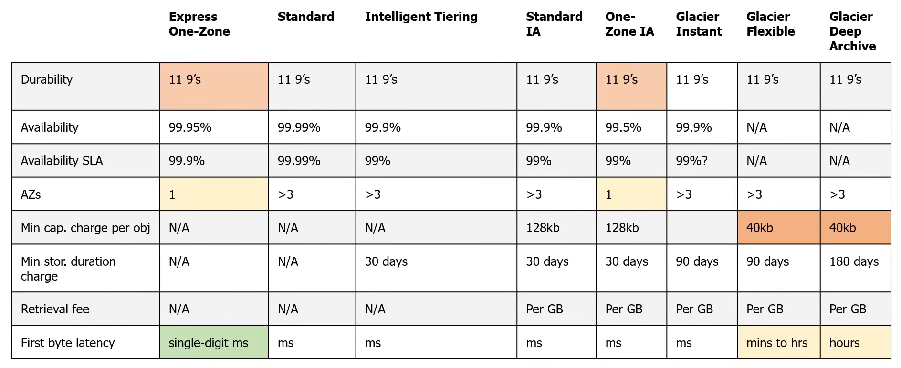

## S3 Security Overview
### Bucket Policies - permissions for an entire S3 buckets using JSON based access policy language
- resource-based policy to grant an s3 bucket and bucket objects to other principles eg. AWS Accounts, Users, AWS Services.
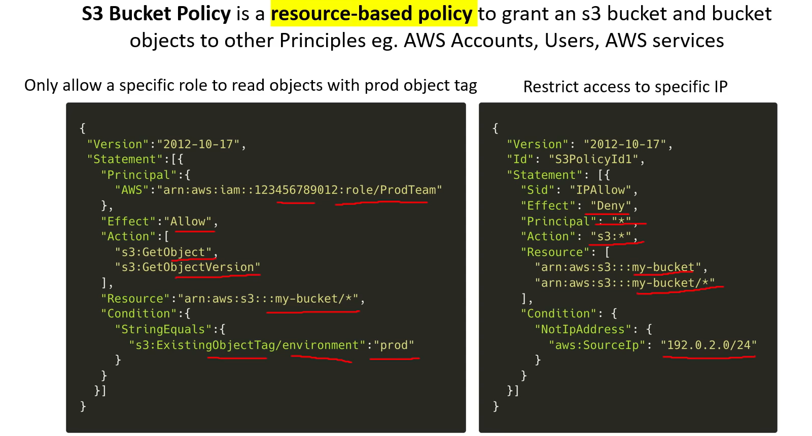

### Access Control Lists (ACLs) - provide a legacy method to manage access permissions on individual objects and buckets.
- Grant basic/read write permissions to other AWS accounts
- you can grant permissions only to other AWS Accounts, not users in your account, not to grant conditional permissions, not to explicitly deny permissions.
- ACLs is a legacy feature of S3 and there are more robust ways to provide cross-account access via bucket policies and access points.
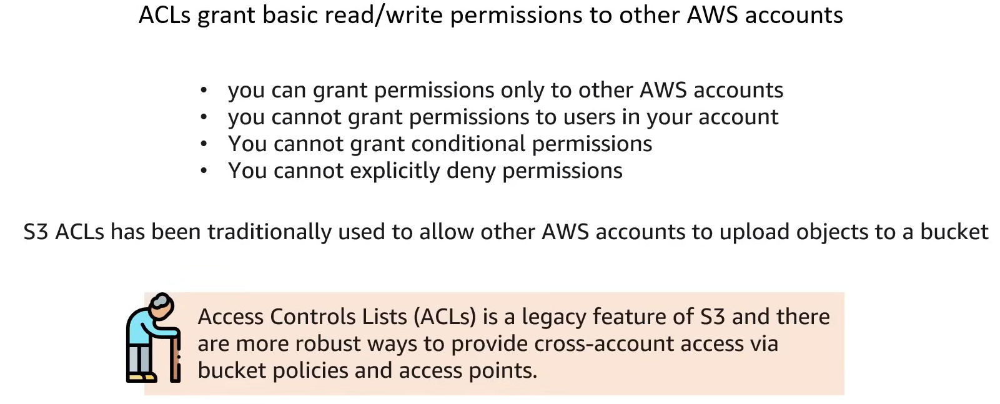

### AWS PrivateLink for Amazon S3 - enables private network access to S3, bypassing the public internet for enhanced security.

### Cross-Origin Resource Sharing(CORS) - Allows restricted resources on a web page from another domain to be requested.

### Amazon S3 Block Public Access - Offers settings to easily block public access to all your S3 resources.
- safety feature that is enabled by default to block all public access to an S3 bucket.
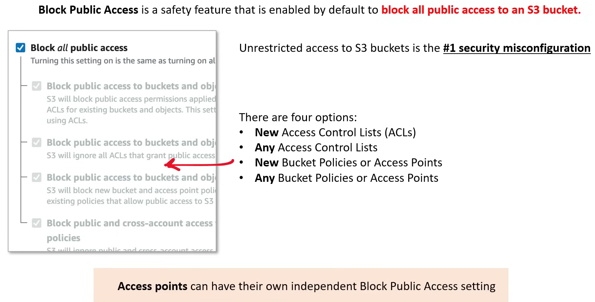

- IAM Access Analyzer for S3 - Analyzes resource policies to help identify and mitigate potential access risks.
- Internetwork Traffic Privacy - Ensures data privacy by encrypting data moving between AWS services and the internet.
- Object Ownership - Manages data ownership between AWS accounts when objects are uploaded to S3 buckets.
- Access Points - simplifies managing data access at scale for shared datasets in S3
- Access Grants - providing access to S3 data via a directory services eg: active directory.
- Versioning - preserves, retrives, and restores every version of every object stored in an s3 bucket.
- MFA Delete - Adds an additional layer of security by requiring MFA for the deletion of S3 objects.
- Object Tags - provides a way to categorize storage by assigning key-value pairs to s3 objects.
- In-transit encryption - protects data by encrypting it as it travels to and from S3 over the internet.
- Server-side encryption - automatically encrypts data when writing it to s3 and decrypts it when downloading
- Client-side encryption - encrypts data client-side before uploading to s3 and decrypts it after downloading.
- Compliance validation for Amazon S3 - ensures S3 services meet compliance requirements like HIPAA, GDPR, etc.
- Infrastructure Security - Protects the underlying infrastructure of the S3 service, ensuring data integrity and availability.

## Bucket Versioning

## Bucket Encryption

## Static Website Hosting